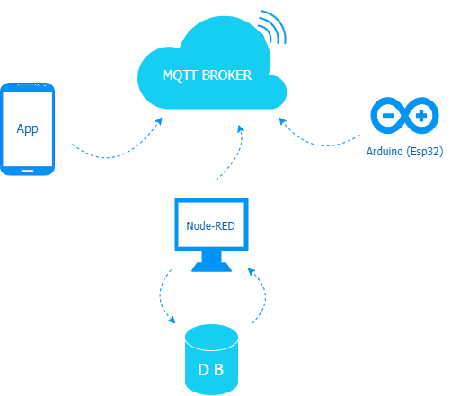
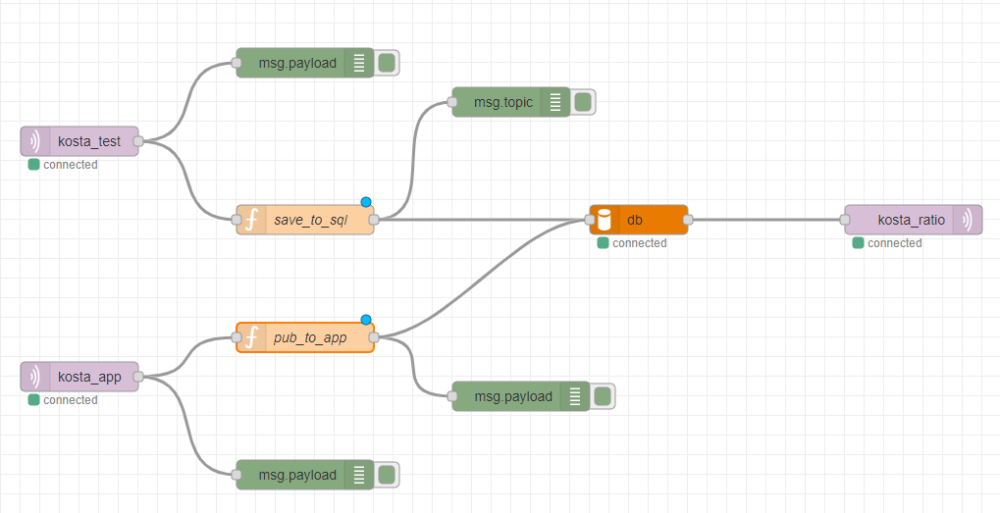

# System Structure

*매장에서 사용되는 버튼 모듈과 MQTT통신으로 브로커를 거쳐서 DB에 저장되는 과정을 정리*

## 모듈 정리

* **MQTT Broker**

    MQTT 통신의 간단한 요약: [**링크**](https://github.com/greenhelix/Useful_Info_Project/blob/ikhwan/Android/MQTT.md)

    Host: [test.mosquitto.org](https://test.mosquitto.org)
    
    Port: 1883

* **Arduino**
    
    아두이노는 메인 데이터 값을 보내는 퍼블리셔 역할이다. 버튼을 누르면 MQTT Broker로 남자, 여자, 입출 데이터 값을 보낸다. 술집 여러개의 데이터를 구분하기 위해 술집마다 ID를 지정하고 Json 데이터 안에 ID를 포함한 남여 입출 내용이랑 시간 값을 보낸다.
    
    더 자세한 내용을 원한다면 [여기](https://github.com/greenhelix/Useful_Info_Project/tree/ikhwan/Arduino)를 클릭하면 된다.

* **Node-RED**

    

    노드래드도 하나의 MQTT 클라이언트로 생각하면 된다. 섭스크라이브 노드를 이용하여 esp32모듈이 publish하는 내용을 들을 수 있다. 이내용을 알맞게 해석하고 데이터배이스에 저장하기 위해 function node를 사용해야하는데 다음 코드를 참고하면 된다:

    * [아두이노 데이터를 mysql에 저장하기](https://github.com/greenhelix/Useful_Info_Project/blob/Joong/Server/node-red_save_to_sql.js)
    
    * [앱에 남녀 비율 값 보내기](https://github.com/greenhelix/Useful_Info_Project/blob/Joong/Server/node-red_pub_to_app.js)

    여기서 노드래드 함수들은 return 값이나 input이 다 msg 형태를 가진 객체임을 주의해야한다.

* **App**

    앱 환경에 대해서: [링크](https://github.com/greenhelix/Useful_Info_Project/tree/ikhwan/Android)

* **mySQL**

    mySQL에 대해서: [링크](https://github.com/greenhelix/Useful_Info_Project/tree/ikhwan/DB)