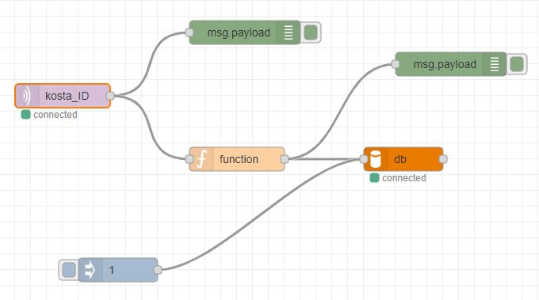

# System Structure

*술집에서 사용되는 버튼 모듈과 MQTT통신으로 브로커를 거쳐서 DB에 저장되는 과정을 정리*

## 모듈 정리

* **Mosquitto MQTT**

    Host: [test.mosquitto.org](https://test.mosquitto.org)
    
    Port: 1883

* **Arduino**
    
    (아두이노 회로도 이미지)
    
    버튼을 누르면 MQTT Broker로 남자, 여자, 입출 데이터 값을 보낸다. 술집 여러개의 데이터를 구분하기 위해 술집마다 ID를 지정하고 ID라는 토픽아래 데이터를 보낸다.
* **Node-RED**

    

    섭스크라이브 노드를 이용하면 msg.payload로 아두이노 데이터 값을 받을 수 있다.

    function으로 javascript을 이용해  데이터 값을 msg.topic라는 함수로 db에 저장 할 수 있다.

    ```javascript
    var sex = msg.payload;
    if(sex == "mu") {
    msg.topic = "INSERT INTO info (sex, numbers) VALUES (m, 1)";
    }
    else if(sex =="md"){
    msg.topic = "INSERT INTO info (sex, numbers) VALUES (m, -1)";
    }
    else if (sex =="fu"){
        msg.topic = "INSERT INTO info (sex, numbers) VALUES (f, 1)";
    }
    else if(sex == "fd"){
        msg.topic = "INSERT INTO info (sex, numbers) VALUES (m, -1)";
    }

    return msg;
    ```
* **mySQL**